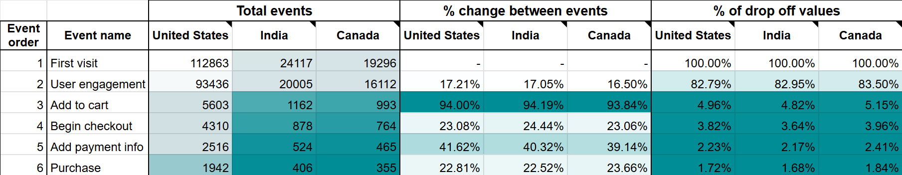
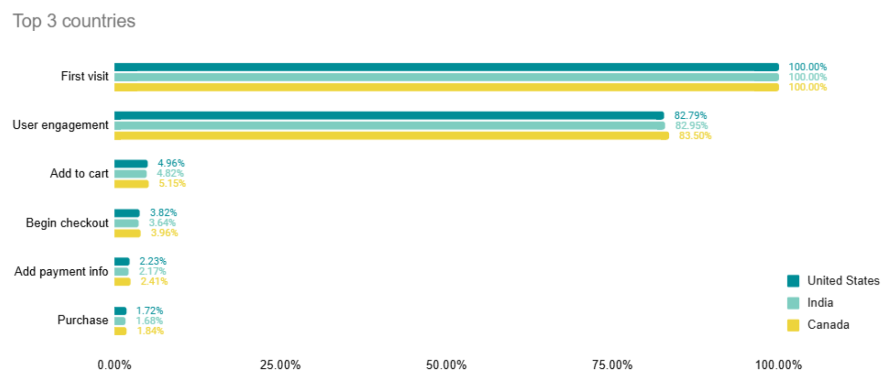
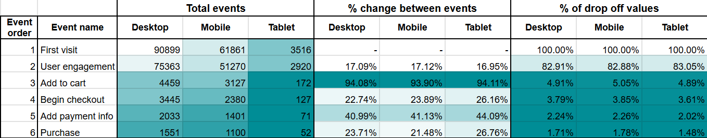
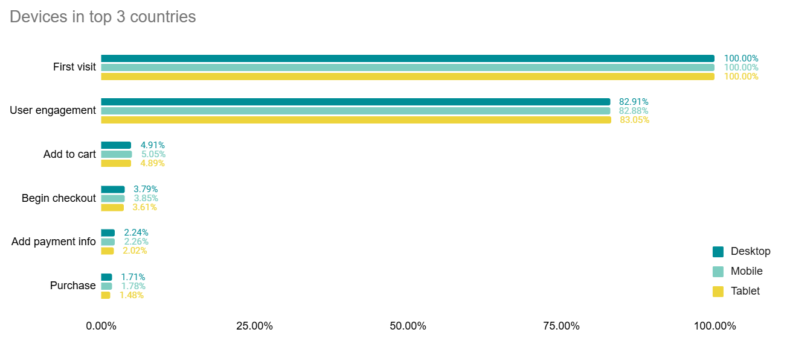

# Funnel Analysis for E-commerce Site

## Project Overview

This project focuses on analyzing the customer journey through a sales funnel using event data from a large dataset. The goal is to understand where users are most likely to drop off in the purchasing process and to identify any significant patterns in user behavior across different countries and devices. This analysis uses SQL for data aggregation and Google Sheets for visualization.

Since this was a learning task, it’s scoped to be a quick analysis rather than a comprehensive project.

## Dataset Information

This project was developed using a proprietary dataset provided for educational purposes, which is not included in the repository due to restrictions. Redistribution or commercial use of the project contents is not permitted.

The primary columns include:

- **"event_timestamp"** - timestamp of the event in UNIX format.
- **"event_name"** - type of event (e.g., `first_visit`, `user_engagement`, `add_to_cart`, `begin_checkout`, `add_payment_info`, `purchase`, etc.).
- **"user_pseudo_id"** - anonymized identifier for users to track sessions without personally identifying information.
- **"category"** - device category, including values such as `desktop`, `mobile`, and `tablet`.
- **"country"** - user's country name.
  
It also had additional columns, but they were not used in analysis. If you'd like to replicate the analysis, you may substitute with a similar dataset.

## Objectives

1. **Remove duplicate events** - write a query to ensure there is only 1 unique event per user. When there are multiple, to show the 1st one only (according to timestamp). 
2. **Aggregate events by country and device** - create a query to identify the top 3 countries by event volume. Create additional one for looking into devices. 
3. **Construct a funnel charts** - using filtered events, create a funnel charts to visualize user drop-off at each stage of the funnel.
4. **Identify key insights** - provide observations regarding user behavior, including device usage and country-specific trends.

## Tech Stack

- **SQL** (BigQuery) – for data extraction and calculations.
- **Google Sheets** – for creating quick visualizations.

## Key Findings

    
    

1. **Country-Specific Insights**:
   - **Countries.** United States is number 1 country by events count. India being 2nd and Canada 3rd.
   - **Top Drop-Off Points.** The "Add to cart" stage has the highest drop-off across all countries. The second-largest drop-off occurs after users start checkout but before adding payment information.
   - **Conversion Rates.** Canada has the highest purchase conversion rate, while India shows the lowest.

    
    

2. **Device-Specific Insights**:
   - **Device Usage.** Desktop is the most commonly used device in the top 3 countries, followed by mobile, with tablets being the least used.
   - **Top Drop-Off Points.** Just as before, same trends of highest drop off points are visible here as well. 
   - **Conversion Rates.** Users on mobile devices show a highest purchase conversion rate. 

## Recommendations

Based on the analysis, here are some recommendations to improve user conversion rates:

- **Optimize checkout experience.** Given that many users drop off at the "Add to cart" and "Add payment info" stages, look into what could be causing issues and simplifying the checkout flow. It could enhance conversion rates. That could be A/B tested to verify.
- **Adding country-specific payment methods.** Because payment methods often vary per country, it could be worthwhile to look into top countries with highest drop off values between payment stages. Expanding payment options may help to increase overall conversion. 
- **Mobile optimization.** Since mobile devices show a highest conversion rate, ensuring a smooth and user-friendly mobile experience may further boost mobile conversions. Also, marketing campaigns can focus on targeting mobile users. 
- **Country-specific promotions.** First, would need to investigate how promotions differ between countries now (if at all). Then could applying tailored versions for top countries with lower conversion rates (like India). It may help retain users and encourage purchase completion.

## Possible Analysis Improvements

To further enhance this analysis, future steps could include:
- Original dataset provides more information.Thus, it would be possible to add additional categories to identify patterns within different operating systems, languages, campaigns, etc.
- Conducting a time-based analysis to understand user behavior trends over different periods.

## How to Use This Repository

1. **"queries"** - SQL queries are available in this folder.
2. **"images"**: visualizations from Google Sheets are provided as screenshots in this folder.

## Contact

LinkedIn - [Agnė Vabalaitė](www.linkedin.com/in/agnė-vabalaitė).
Gmail - vab.agne@gmail.com